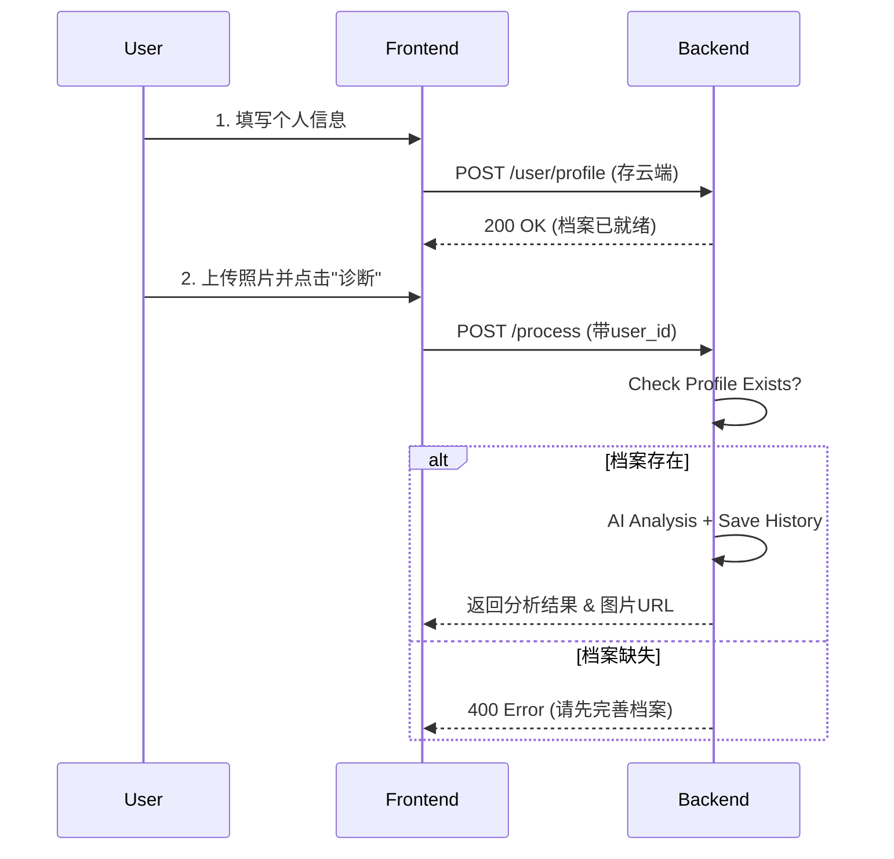

# 10K项目 - 全云端数据托管协议 (Cloud-Native Protocol)

本文档定义了基于 **全云端托管** 架构的前后端交互标准。所有用户数据（档案、图片、历史）均存储在阿里云服务器上。

---

## 🏗️ 1. 核心业务流程 (Business Workflow)

为了确保 AI 分析的准确性，系统严格遵循 **"先档案，后分析"** 的原则。

1.  **第一步：完善档案**
    用户在前端填写个人信息（年龄、肤质等），点击保存。前端调用 `POST /user/profile` 将数据同步至云端。

2.  **第二步：上传图片并分析**
    用户上传照片并点击“生成报告”。前端调用 `POST /process`。
    *   **后端校验**: 检查该用户是否已存在云端档案。
    *   **若无档案**: 返回错误，提示用户先填写档案。
    *   **若有档案**: 读取档案 -> 结合图片分析 -> 生成报告 -> 存入历史记录。

---

## 📂 2. 服务器目录结构

```text
/path/to/your/project/data/
├── users/
│   ├── {user_id}/
│   │   ├── profile.json            # 核心档案 (分析的基石)
│   │   ├── history/                # 历史诊断记录
│   │   └── images/                 # 用户图片索引
└── uploads/                        # 物理图片库
    └── 2026/03/06/
        └── ...
```

---

## 🔄 3. API 接口定义

### 3.1 用户档案管理 (Profile)

*   **接口**: `POST /user/profile`
*   **作用**: 创建或更新用户档案。这是分析的**前置条件**。
*   **Body**:
    ```json
    {
      "user_id": "user_123",
      "data": { "age": 25, "skin_type": "oily", ... }
    }
    ```

### 3.2 智能诊断 (Diagnosis)

*   **接口**: `POST /process`
*   **作用**: 执行 AI 分析并归档。
*   **参数**: `file` (图片), `user_id` (必填)

#### 后端逻辑 (关键变更)
1.  **校验档案**: 检查 `data/users/{user_id}/profile.json` 是否存在。
    *   ❌ **不存在**: 拒绝请求，返回 `400 Profile Missing`。
    *   ✅ **存在**: 读取档案内容，加载到上下文。
2.  **执行分析**: DeepSeek 结合档案数据进行个性化诊断。
3.  **自动归档**: 生成 `history/record_{timestamp}.json`。

---

## 📝 4. 前端对接时序


